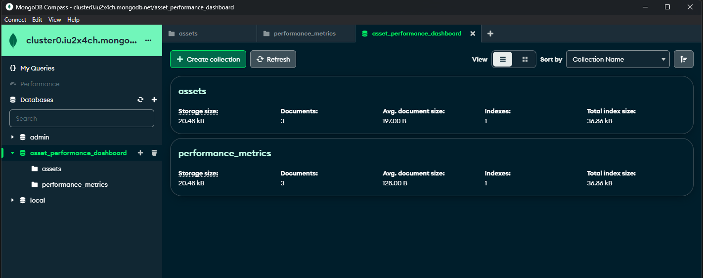
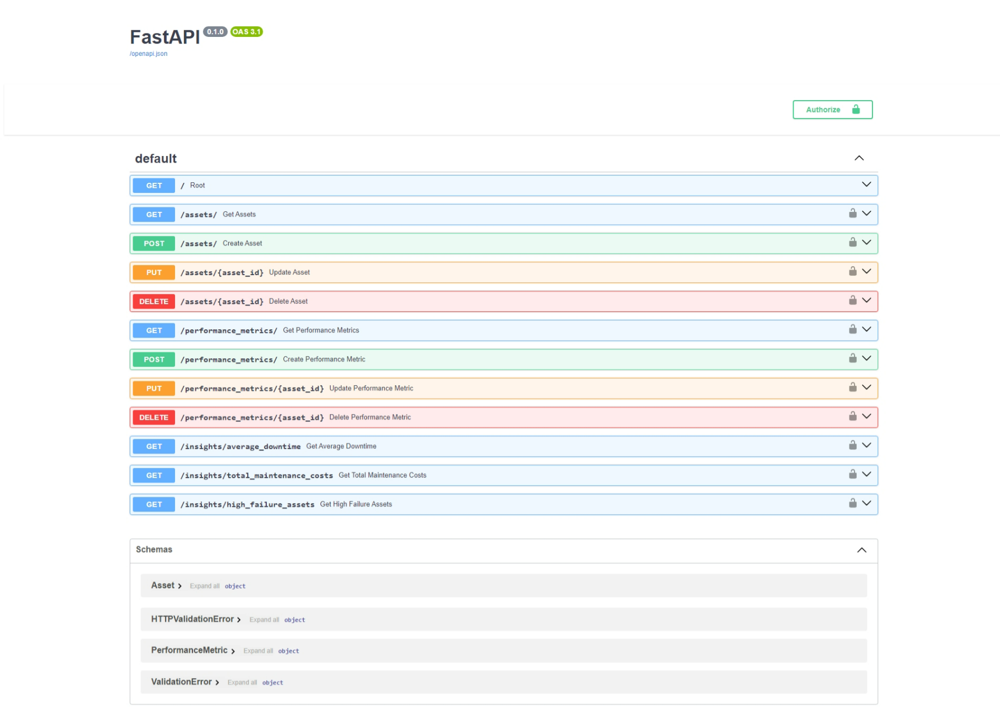

# Asset Performance Dashboard API

This is a sample FastAPI application serving as the backend for an Asset Performance Analytics Dashboard. The application interacts with a MongoDB database to analyze and collate data related to various assets' performance.

## Table of Contents
1. [Main Functionality](#main-functionality)
2. [Project Structure](#project-structure)
3. [Installation & Setup](#installation)
4. [Usage](#usage)
5. [Endpoints](#endpoints)
6. [Testing](#testing)

## Main Functionality <a name="main-functionality"></a>
- CRUD operations for assets and performance metrics.
- Endpoints for aggregating data to provide insights.
- Simple authentication to secure sensitive endpoints.

## Project Structure <a name="project-structure"></a>
- **main.py**: Contains the FastAPI application with endpoint definitions and MongoDB integration.
- **test_api.py**: Includes test functions to validate the functionality of the API endpoints.
- **assets.json**: Sample data file containing asset information.
- **performance_metrics.json**: Sample data file containing performance metrics.

## Installation & Setup <a name="installation"></a>

1. Python Environment: Ensure that you have Python installed on your system.

2. MongoDB Database: You need to have MongoDB installed and running locally or have access to a MongoDB instance.
   
3. Navigate to your project directory and create a new virtual environment
   ```bash
   python -m venv venv
   ```

4. Activate the Virtual Environment:
   On Windows, you should use:
   ```bash
   .\venv\Scripts\activate
   ```
   On Unix-based systems, you would use:
   ```bash
   source venv/bin/activate
   ```

5. Install the required dependencies.
   ```bash
   pip install fastapi pydantic uvicorn pymongo requests
   ```

6. Configure MongoDB Connection: Open the main.py file and ensure that the MongoDB connection string is correctly configured. Replace the connection string "mongodb+srv://<username>:<password>@<cluster_url>" with your       MongoDB connection string. Also, ensure that the database name "asset_performance_dashboard" matches the name of your MongoDB database.

7. Sample data files assets.json and performance_metrics.json contain mock data for assets and performance_metrics, respectively. You can use these files to populate the database with sample data for testing.
   Create 2 collections 'assets' and 'performance_metrics' in the 'asset_performance_dashboard' database.
   
   

9. Start the FastAPI server:
    ```bash
    uvicorn main:app --reload
    ```
    
## Usage <a name="usage"></a>

1. The API will be available at [http://127.0.0.1:8000/](http://127.0.0.1:8000/).
2. Once the application is running, you can access the API documentation at [http://127.0.0.1:8000/docs](http://127.0.0.1:8000/docs).

   


### Authentication

The API uses HTTP Basic Authentication for user authentication. The default username and password are provided in the main.py file.
    
    Username = admin
    Password = password
    
Every endpoint other than root and /docs needs authentication.

## MongoDB Schema Design

### Assets Collection

- **asset_id**: Unique identifier for the asset.
- **asset_name**: Name of the asset.
- **asset_type**: Type or category of the asset.
- **location**: Location where the asset is deployed.
- **purchase_date**: Date when the asset was purchased.
- **initial_cost**: Initial cost of the asset.
- **operational_status**: Current operational status of the asset.

### PerformanceMetrics Collection

- **asset_id**: Unique identifier for the asset.
- **uptime**: Duration the asset was operational.
- **downtime**: Duration the asset was non-operational or down.
- **maintenance_costs**: Total maintenance costs incurred for the asset.
- **failure_rate**: Rate of failures experienced by the asset.
- **efficiency**: Efficiency percentage of the asset.

## API Endpoints <a name="endpoints"></a>

- **GET /assets/**: Retrieve all assets.
- **POST /assets/**: Create a new asset.
- **PUT /assets/{asset_id}**: Update an existing asset.
- **DELETE /assets/{asset_id}**: Delete an existing asset.
- **GET /performance_metrics/**: Retrieve all performance metrics.
- **POST /performance_metrics/**: Create a new performance metric.
- **PUT /performance_metrics/{asset_id}**: Update an existing performance metric.
- **DELETE /performance_metrics/{asset_id}**: Delete an existing performance metric.

  ### Insights
- **GET /insights/average_downtime**: Get the average downtime across all assets.
- **GET /insights/total_maintenance_costs**: Get the total maintenance costs across all assets.
- **GET /insights/high_failure_assets**: Get the assets with high failure rates.

## Testing <a name="testing"></a>

1. Ensure the FastAPI application is running.

2. Run the test_api.py script to execute individual tests for each API endpoint.

```bash
python test_api.py
```
Review the output to verify the functionality of each endpoint.


